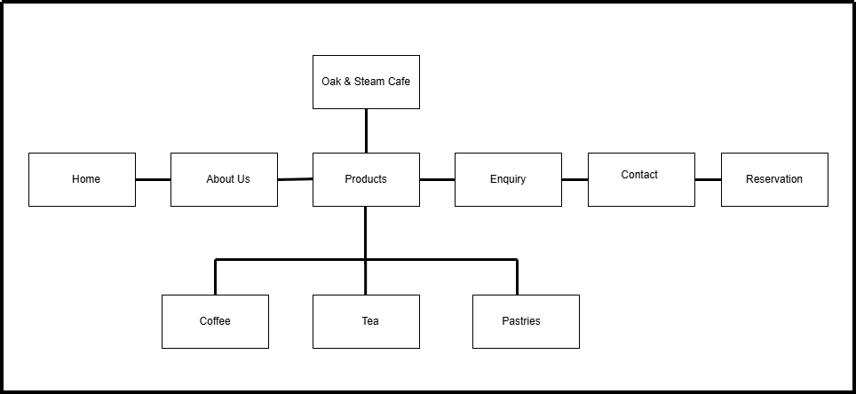

# Project Title #
- Oak & Steam
# Student Information #
- ST10518910
- Luyanda Owethu Mnisi
# Project Overview #
## Brief HIstory
Locally owned Oak & Steam Café opened its doors in Pretoria, South Africa, in 2019. It was founded by two friends who were very passionate about freshly baked goods, homemade teas, and fine coffee. What began as a tiny neighborhood coffee shop has developed into a welcoming gathering place where people go to unwind, work, study, or catch up with friends. The café is well-known for its welcoming atmosphere, attentive service, and commitment to using locally sourced, fresh ingredients whenever possible.
## Vision 
To become the most well-known café in South Africa by fostering strong relationships with premium coffee, handcrafted beverages, and freshly baked pastries in a welcoming setting.
## Mission
In addition to delivering excellent coffee, unique teas, and freshly baked goods made with premium ingredients, our aim is to create a warm and inviting atmosphere where every guest feels at home. We are committed to fostering a healthy atmosphere, supporting regional vendors, and building enduring relationships within our community.
## Target Audience
- University students and college students 
- Families 
- Coffee and tea lovers 
- Local residents and tourists 
# Website Goals and Obejectives
## Objectives 
The primary goal of the Oak and Steam Café website is to create a visually appealing and easy-to-use platform where clients can browse our menu, discover more about the café, and obtain crucial information prior to their visit.
## Goals
- Building brand awareness: By developing a website for Oak and Steam, we are attracting both new and existing customers to our café.
- Menu display: By providing a clear menu, patrons may view the various coffee, tea, and baked goods that are offered, along with prices and any necessary explanations.
- Increasing customer visits and promoting customer interaction: The website will include helpful information, such as the location and contact details of the café, which will entice customers to come in person and ask questions.
# Key Features and Functianlity #
1. Navigation Bar
- Links to Home, About Us, Products, Enquiry, and Contact. 
- Makes it easy for customers to move through sections.
2. . Home Page
- Introduces Oak and Steam Café with a short and welcoming text
- Includes a short description of what the café offers.
3. About Us Page
- Provides information about the café’s history, vision, and mission.
- Explains what makes Oak & Steam Café different. 
. Product Page
4. Displays the café’s products in an ordered way.
 Separates products into categories such as coffee, tea, cookies and doughnuts.
 Includes product names, images, short descriptions, and prices. 
5. Enquiry Page
- offers a simple form where customers can make enquiries. 
- Includes fields such as name, phone number, email, and message. 

6. Contact Page
- Provides important contact information such as Phone number, WhatsApp, Email address, Physical location, Opening hours 
- Makes it easy for customers to get in touch with the café.
7. Footer
- Appears at the bottom of each page. 
Contains important links and basic café information. 
- Includes social media links and navigation links. 
8. Reservation Page
- Offers a simple form for customers to make reservations bookings.
- Includes fields such as name, phone number, email, and message. 
- Includes a submit button. 
# Technologies Used #
- HTML
- GIT
- VISUAL STUDIO CODE
- Github
# Timeline and Milestone
| Date | Task | 
|---------|----------|
10–14 Aug |   Create the website structure and    basic HTML pages. Set up navigation, homepage, About Us, Products, Enquiry and Contact sections.|
17–31 Aug | Develop the CSS styling. Apply the Oak & Steam colour scheme, fonts, buttons, spacing and product cards.|
4 Sep- 11 Sept | Test the website on different screen sizes, check links, forms, spelling, images and navigation. Fix any errors.|
14–18 Sep | Final improvements, proofread documentation, compare the website against the proposal requirements, prepare screenshots/presentation and submit.|
# Part 1 Detail #
# Sitemap #

# Changelog #
| commit | Date| changes made |
|---------|----------|----------|
1st commit| 13 Aug 2026 | Created home page |
2nd commit||Created About Us page|
3rd commit| |added image|
4th commit| |added image|
6th commit||added product page |
7th commit|14 Aug |updated About Us & enquiry page banner and page|
8th commit| |updated all pageds and the reservation page|
final commit| | updated all pages and added readme file.
# References # 
- Pexels, 2024. *cup-of-coffee*. [online] Availabe at: 
<https://www.pexels.com/photo/cup-of-coffee-26083138/ > [Accessed 12 August 2026].
- Pexels, 2022. *a-cup-of-green-tea-with-an-apple-cut-in-half*. [online] Availabe at: 
<https://www.pexels.com/photo/a-cup-of-green-tea-with-an-apple-cut-in-half-10776450/>  [Accessed 12 August 2026].
- Pexels, 2018. *man-sitting-by-the-table*. [online] Availabe at: 
<https://www.pexels.com/photo/man-sitting-by-the-table-in-cafe-2067552/>  [Accessed 12 August 2026].
- Pexels, 2020. *signs-with-numbers-in-restaurant*. [online] Availabe at: 
<https://www.pexels.com/photo/signs-with-numbers-in-restaurant-5836534/>  [Accessed 12 August 2026].
- Pexels, 2025. *scozy-bakery-display-with-assorted-fresh-pastries*. [online] Availabe at: 
<https://www.pexels.com/photo/cozy-bakery-display-with-assorted-fresh-pastries-32459865/>  [Accessed 12 August 2026].
- Pexels, 2024. *porcelain-cup-of-black-coffee-on-a-saucer*. [online] Availabe at: 
<https://www.pexels.com/photo/porcelain-cup-of-black-coffee-on-a-saucer-25811262/>  [Accessed 12 August 2026].
- Pexels, 2025. *cappuccino-in-glass-mug-on-a-rustic-table*. [online] Availabe at: 
<https://www.pexels.com/photo/cappuccino-in-glass-mug-on-a-rustic-table-34035526/>  [Accessed 12 August 2026].
- Pexels, 2024. *selective-focus-of-cappuccino*. [online] Availabe at: 
<https://www.pexels.com/photo/selective-focus-of-cappuccino-26083143/>  [Accessed 12 August 2026].
- Pexels, 2021. *woman-brewing-herb-tea-and-white-flowers-on-table*. [online] Availabe at: 
<https://www.pexels.com/photo/woman-brewing-herb-tea-and-white-flowers-on-table-8329261/>  [Accessed 12 August 2026].
- Pexels, 2020. *a-person-pouring-tea-in-the-cup*. [online] Availabe at: 
<https://www.pexels.com/photo/a-person-pouring-tea-in-the-cup-5760206/>  [Accessed 12 August 2026].
- Pexels, 2021. *herbs-and-spices-on-beverage*. [online] Availabe at: 
<https://www.pexels.com/photo/herbs-and-spices-on-beverage-8330390/>  [Accessed 12 August 2026].
- Pexels, 2025. *freshly-baked-croissants-at-berlin-bakery*. [online] Availabe at: 
<https://www.pexels.com/photo/freshly-baked-croissants-at-berlin-bakery-30667029/>  [Accessed 12 August 2026].
- Pexels, 2026. *delicious-strawberry-topped-pastries-display*. [online] Availabe at: 
<http://pexels.com/photo/delicious-strawberry-topped-pastries-display-37039289/>  [Accessed 12 August 2026].
-  Pexels, 2026. *delicious-raspberry-danish-pastries-on-tray*. [online] Availabe at: 
<http://pexels.com/photo/https://www.pexels.com/photo/delicious-raspberry-danish-pastries-on-tray-38430719/>  [Accessed 12 August 2026].
- Pexels, 2021. *a-display-counter-in-a-cafe*. [online] Availabe at: 
<https://www.pexels.com/photo/a-display-counter-in-a-cafe-8909525/>  [Accessed 12 August 2026].

